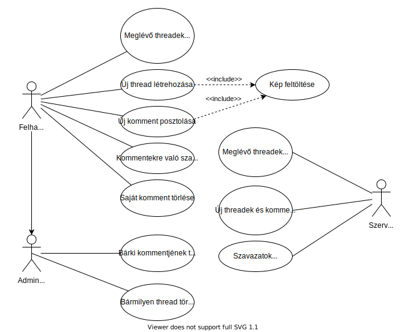

# Üzleti Igények

Az IntrendChan egy olyan image board webalkalmazás, melyen a felhasználók különböző témákat beszélhetnek meg szabadon. A program felépítésben és funkcionálisan is hasonlít a klasszikus image board-okra, néhány kivétellel. A különzöző témájú diszkussziókat board-ok különítik el, melyek között a felhasználó a főoldalon tud választani. A boardok előre definiáltak, egy felhasználó nem tud újat létrehozni. A boardokon belül a felhasználó szabadon indíthat thread-eket tetszőleges, a board témájához kapcsolódó tartalommal, melyhez bármelyik felhasználó kommentelhet. Követelmény, hogy minden thread képpel és szöveggel kell, hogy kezdődjön, az azokhoz fűzött kommenteknél a kép hozzáfűzése opcionális, azonban mindenképpen egy lehetőség. A board-okon belül a threadek mindig olyan sorrendben vannak listázva, hogy melyikhez érkezett legutoljára komment, kivéve, ha a komment olyan opcióval lett elküldve, hogy az ne számítson bele ebbe - ezt a komment mező alatt egy checkbox teszi lehetővé.

A program a tradícionális image board-októl a következő módokban tér el: az IntrendChan tartalmaz felhasználókezelést, azaz sok más image board-dal ellentétben a threadindítás és kommentelés nem anonim, hanem kötelezően belépés után van csak rá lehetőség. A felhasználó tudja törölni a saját kommentjeit, azonban egy thread csak akkor törölhető, ha ahhoz egy komment sem tartozik. Ha egy felhasználó egy olyan kommentet töröl, melyhez egy kép is csatolva van, akkor a képfájl a szerverről is kötelezően törlődik. A program tartalmaz role kezelést, tehát egy felhasználó rendelkezhet user vagy adminisztrátori jogokkal - az utóbbi esetben bármilyen hozzászólást vagy threadet jogában áll letörölni.

Az IntrendChan másik nagy feature-je, mely megkülönbözteti a hagyományos image board-októl, az a kommentekre való szavazási lehetőség. A kommentek mellett található egy szám, mely a szavazatok számát mutatja, illetve egy fel és egy lefelé mutató nyíl, melyek segítségével a felhasználó szavazhat a kommentre. Minden kommentre csak egy szavazatot küldhet egy felhasználó (vagy fel, vagy le), de természetesen maga a szavazás opcionális. Lehetőség van a threadek alatti kommentek kronológikus, illetve szavazat alapján való rendezésére is.

## Követelménylista:
| ID | Fontosság | Követelmény |
|-:|-:|-|
| 1 | magas | A felhasználó tud új fiókot regisztrálni |
| 2 | magas | A felhasználó be tud lépni a fiókjába |
| 3 | magas | A főoldal kilistázza a board-okat |
| 4 | magas | A board-okon belül egy belépett felhasználó tud threadeket létrehozni |
| 5 | magas | A thread-eket mindig képpel és szöveggel kell indítani |
| 6 | magas | A thread-ekhez egy belépett felhasználó tud kommentet fűzni |
| 7 | magas | A kommentekhez lehet képet fűzni, de nem kötelező |
| 8 | közepes | Mindig az a thread kerül előbb listázásra, amihez legutóbb érkezett komment |
| 9 | alacsony | Lehet olyan kommentet küldeni, melytől a thread nem kerül feljebb a listában |
| 10 | közepes | Van adminisztrátori és rendes user role |
| 11 | közepes | Belépett felhasználó letörölheti a saját kommentjeit |
| 12 | közepes | Egy thread csak akkor törölhető az azt posztoló user által, ha ahhoz nem tartozik több komment |
| 13 | közepes | Az adminisztrátori role bármilyen kommentet vagy threadet letörölhet |
| 14 | alacsony | Ha egy olyan komment/thread törlődik, melyhez kép tartozott, akkor a képfájl a szerverről is törlődjön |
| 15 | közepes | A kommentekre lehet szavazni, fel vagy lefelé |
| 16 | közepes | Egy kommentre egy user csak egy szavazatot küldhet |
| 17 | közepes | A kommentek mellett egy szám mutatja, hogy a komment hány szavazattal rendelkezik |
| 18 | alacsony | A kommenteket lehet kronológikusan, vagy szavazat alapján rendezni |

# Tervek

A felhasználó jelszavát természetesen nem plain textben tároljuk el, hanem valami hashelést végzünk - azonban még célszerűbb, ha erre valami libraryt használunk majd.

## Use-case diagram

## Entytik class-diagramja

## Szenvencia-diagramok